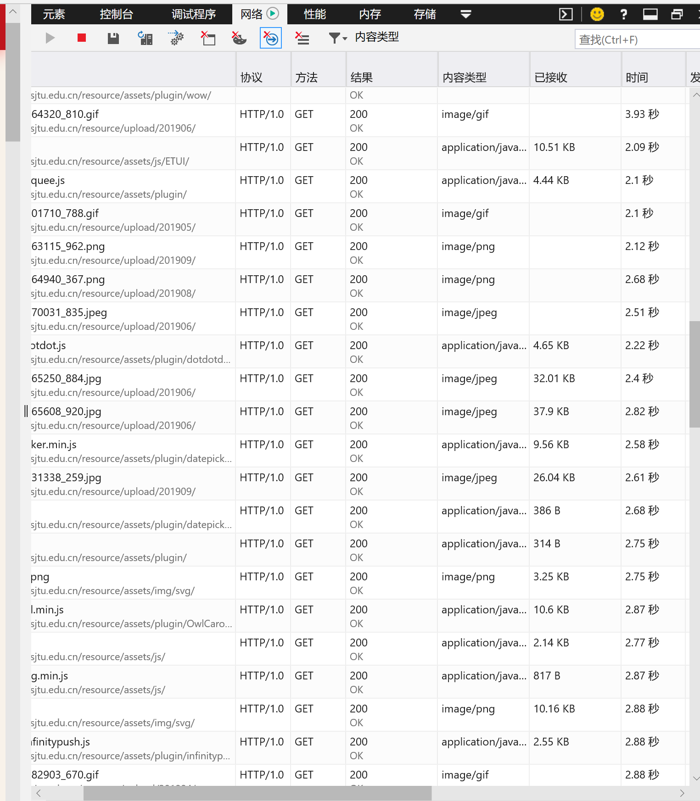
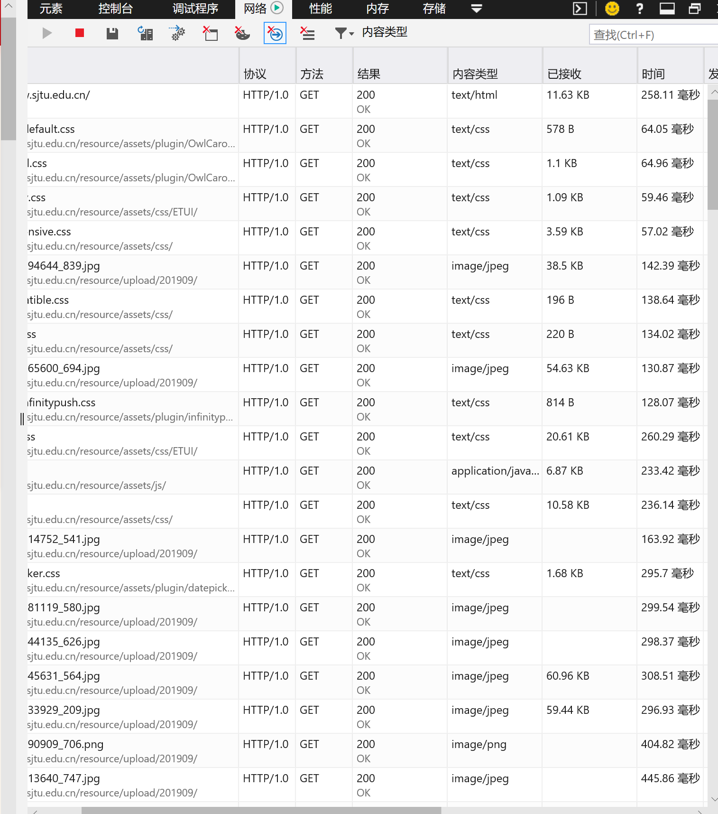
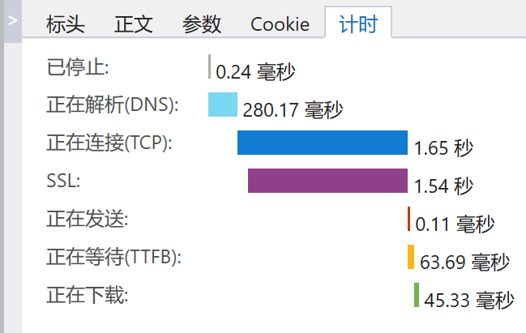

# The analysis of SJTU Website
---
 &emsp;when I open the official website of [Shanghai Jiaotong University](https://www.sjtu.edu.cn/), I found it loading too slowly. So I open the 'f12' and switch to the 'Network' label to find which elements made it so slow. And I searched some ways to make the speed faster.

---
**Reduce HTTP requests**
&emsp;When we open a website, we will initiate some HTTP requests. These requests requires time. If the requesets are too many, the time will be very long, which might cause the decrease of users.
&emsp;When I open the sjtu official website, click on 'f12' and turn the page to 'Network', I find so many time wasting on loading the photographs.

From the picture above we can see that images take us much time to open the website.

From the picture above we can see that other files, such as css and text don't take us much time.
&emsp;When we open this website, these numerous pictures call numerous HTTP requests. So what should we do to decrease the number of requests?
* Combine many related pictures to one picture.
&emsp;&emsp;If the website has five pictures and each one will go to a link, we will raise five HTTP requests when we open the website. But one picture only raise on request, so if we combine the five pictures, we will reduce the loading time. 
* Data:url mode.
&emsp;&emsp;Data :url mode allows you to render images on a page without requiring additional HTTP requests
``
This way has a shortage:If an image is used on multiple pages, the browser cache cannot be utilized.We can define the picture's data in CSS file to solve this problem
&emsp;```
.imageA {
   background-image: url(data:image/jpg;base64, xxxxxxxxxxxxxxxx);
}```
* Combine the CSS and js files.
&emsp;&emsp;This is a commonly used way to optimize the speed of loading a website. In this way, we can reduce the files we need to connect when we open the webiste.From the picture below we can see that the JS files cost us much time in connecting TCP.
(SSL is a agreement to encrypt and maintain data integrity)

* Add expires.
&emsp;&emsp;Expires adds the expiration date of the resource, and the browser compares that expiration date to the client's time. If the expiration date is not reached, the browser reads the resource in the cache. If it has expired, the browser determines that the resource is no longer fresh and wants to retrieve it from the server. In this way, it is possible to read directly from the browser cache without the server having to determine whether the cache is already in place, thus avoiding this HTTP request.